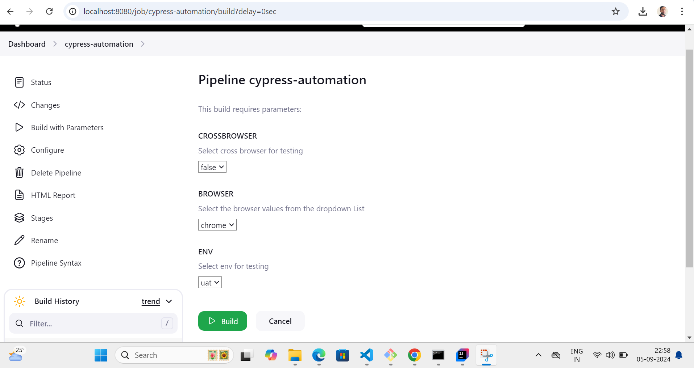

# cypress-cucumber-esbuild-jenkins
1. Create repository online on git hub and do git clone locally using below command
2. git clone https://github.com/aditya2001/cypress-cucumber-esbuild-jenkins.git
3. Open VC code locally and do npm init to create package.json and added required folder structures
4. Do git init to convert to git repository, .git folder get created

## Installing node on local windows.
1. Navigate to URL https://nodejs.org/en/download/prebuilt-installer, and download windows installer package.

## Test Execution - Command line
### When you want to run specific feature file on specific browser and specific env.
npx cypress run --browser chrome --spec cypress/e2e/features/* --config baseUrl="https://www.saucedemo.com"

### When you want to run scenarios in parallel- use below script
1. cypress:parallel:chrome
We are using package cypress-parallel for parallel execution of Scenarios.

## Test Execution via Jenkins
The Paramterized Jenkins job should look like below. The entire configuration is done in Jenkins file.
By default test will run with cross browser values as false. User can updated cross browser to true and test will run on all browsers.

## HTML reports

Note- If you face issues viewing html report, type below in Manage Jenkins-->Script Console
#### command
System.setProperty("hudson.model.DirectoryBrowserSupport.CSP", "sandbox allow-same-origin allow-scripts allow-popups allow-downloads; default-src 'self'; img-src 'self' data:; style-src 'self' 'unsafe-inline'; script-src 'self' 'unsafe-inline'; media-src 'self'; font-src 'self'; frame-src 'self' data:;")

