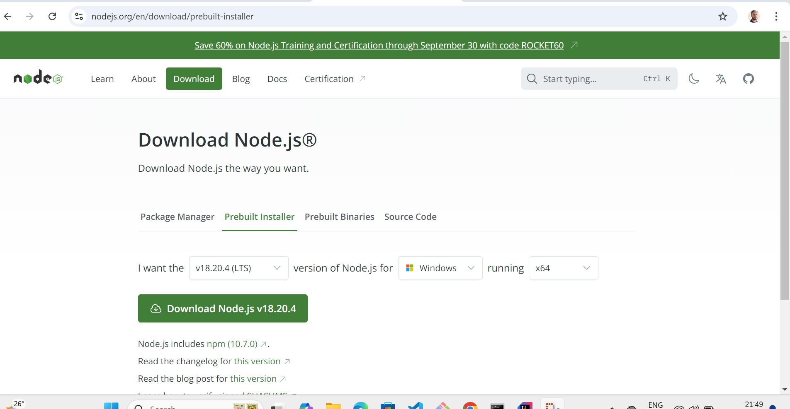

# cypress-cucumber-esbuild-jenkins
1. Create repository online on git hub and do git clone locally using below command
2. git clone https://github.com/aditya2001/cypress-cucumber-esbuild-jenkins.git
3. Open VC code locally and do npm init to create package.json and added required folder structures
4. Do git init to convert to git repository, .git folder get created

## Installing node on local windows.
1. Navigate to URL https://nodejs.org/en/download/prebuilt-installer, and download windows installer package.

## Test Execution - Command line
### When you want to run specific feature file on specific browser and specific env.
npx cypress run --browser chrome --spec cypress/e2e/features/* --config baseUrl="https://www.saucedemo.com"

## When you want to run sceanrios in parallel- use below script
cypress:parallel:chrome
We are using package cypress-parallel for parallel execution of Scenarios.

